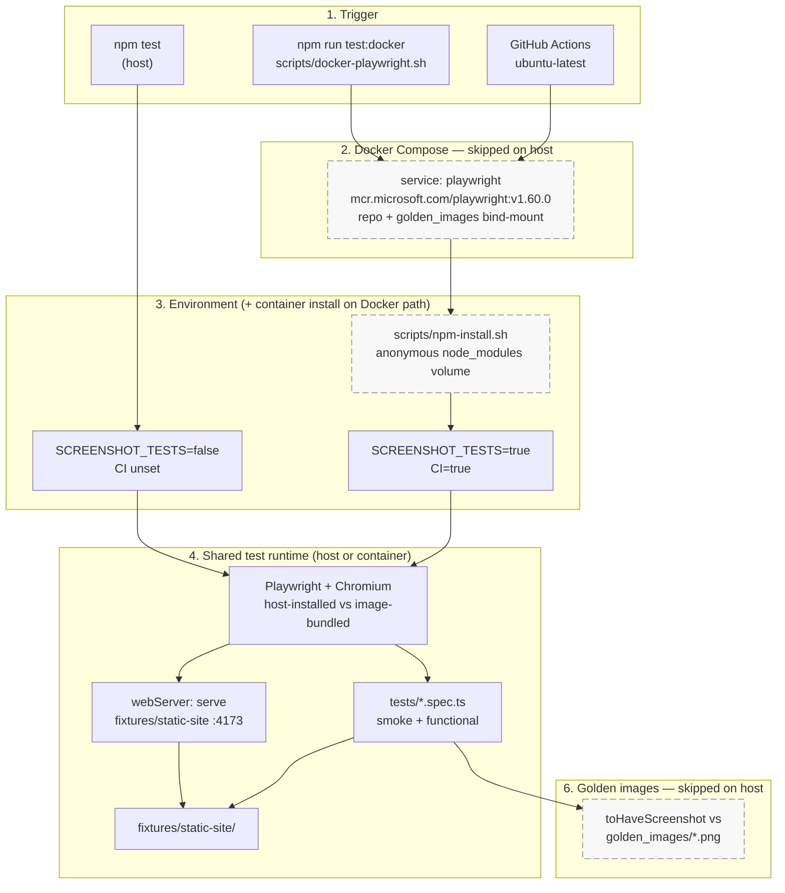

# playwright-in-docker-poc

Playwright end-to-end tests run inside the official Microsoft Playwright Docker image. Local runs and CI both use **Docker Compose** so screenshot golden images match Linux rendering.

## Architecture

Golden-image screenshot tests depend on a stable browser/OS rendering stack. This repo runs **functional tests on the host** for fast feedback and runs the **full suite (including screenshots) inside the official Playwright Linux image** so local Docker runs and CI share the same pixels.

One pipeline; dashed nodes are **skipped** when you run `npm test` on the host.



On **host**, steps 2, 3 (`npm-install` in container), and 6 (golden compare) are skipped; Playwright goes straight from `npm test` to the shared runtime with `SCREENSHOT_TESTS=false`, so screenshot specs do not run. On **Docker / CI**, the full path runs inside Linux for stable rendering.

| Step              | Host (`npm test`)                                        | Docker / CI (`docker compose run --rm playwright`)                       |
| ----------------- | -------------------------------------------------------- | ------------------------------------------------------------------------ |
| 1. Trigger        | `npm test` on your machine                               | `test:docker`, `docker-playwright.sh`, or GHA workflow                   |
| 2. Docker Compose | **Skipped**                                              | Playwright image; repo + `golden_images/` mounted at `/workspace`        |
| 3. Setup          | **Skipped** (use host `node_modules`)                    | `npm-install.sh` in container; isolated `node_modules` volume            |
| 4. Env            | `SCREENSHOT_TESTS=false`                                 | `SCREENSHOT_TESTS=true`, `CI=true`                                       |
| 5. Runtime        | Host Chromium + `serve` on 4173 → smoke/functional tests | Same `webServer` and specs, but browser/OS inside the image              |
| 6. Golden images  | **Skipped** (OS/fonts may differ from CI)                | `toHaveScreenshot` compares `golden_images/`; failures → `test-results/` |

`playwright-update-snapshots` follows the Docker path (steps 2–6) to regenerate baselines into the bind-mounted `golden_images/`.

### Why this split: pros and cons

| Pros                                                                                                                                                               | Cons                                                                                                                                                                                           |
| ------------------------------------------------------------------------------------------------------------------------------------------------------------------ | ---------------------------------------------------------------------------------------------------------------------------------------------------------------------------------------------- |
| **Deterministic screenshots** — Docker/CI use one Linux + Chromium stack; golden images are not tied to macOS/Windows font or GPU differences.                     | **Docker required for full confidence** — Developers need Docker for screenshot tests and snapshot updates unless they opt into `SCREENSHOT_TESTS=true` on the host (may still drift from CI). |
| **Same command locally and in CI** — `docker compose run --rm playwright` avoids “works on my laptop, fails in Actions”.                                           | **Slower full runs** — Container startup, image pull, and in-container `npm install` add latency vs bare `npm test`.                                                                           |
| **Fast local loop** — `npm test` skips screenshots; no container for everyday functional checks.                                                                   | **Two environments to reason about** — Host Chromium vs image Chromium; debugging screenshot failures often means reproducing inside Docker.                                                   |
| **Official image** — Browsers and system deps match [Playwright’s supported Docker setup](https://playwright.dev/docs/docker); less custom Dockerfile maintenance. | **Volume/bind-mount quirks** — `node_modules` isolation and file permissions on some hosts need the compose layout (see `docker-compose.yml`).                                                 |
| **Self-contained fixtures** — `webServer` serves static HTML from the repo; no flaky third-party pages in snapshots.                                               | **Screenshot tests are environment-sensitive** — Any change to viewport, fonts, or anti-aliasing in the image version requires regenerating `golden_images/`.                                  |

## Prerequisites

**Local functional tests** (screenshot tests skipped):

- Node.js 18+
- npm

**Full suite and golden images** (required for screenshot comparison):

- Docker CLI and Docker Compose v2 (`docker compose`)
- **Docker Desktop is not allowed.** On macOS, use [Colima](https://github.com/abiosoft/colima) with Homebrew packages `docker`, `docker-compose`, and `colima` — see [Alternatives to Docker Desktop](https://coda.io/d/Infrastructure_dboaRXZbw4w/Alternatives-to-Docker-Desktop_suiCib-Z#_luBqbr4_):

  ```shell
  brew install colima docker docker-compose
  colima start
  ```

  Verify with `docker run hello-world`. Start Colima (`colima start`) before `npm run test:docker` if the VM is not already running.

- On Linux, install Docker Engine and the Compose plugin from your distribution.

## Installation

```shell
npm install
```

Optional — run Playwright on the host without Docker:

```shell
npm run install:browsers
```

Pull the Playwright Docker image:

```shell
docker pull mcr.microsoft.com/playwright:v1.60.0
```

## Running tests

Local `npm test` runs functional checks only. Golden-image screenshot tests are skipped so OS rendering differences do not fail on your machine.

```shell
# Full suite in Docker (including screenshot tests) — same as CI
npm run test:docker

# Or directly
docker compose run --rm playwright

# Local (screenshot tests skipped)
npm test
```

### Headed mode, UI, debugger

```shell
npm run test:headed
npm run test:ui
npm run test:debug
```

To run screenshot comparison on the host (optional; may differ from CI):

```shell
SCREENSHOT_TESTS=true npm run test:ci
```

## Golden images

Expected screenshots live in `golden_images/`. Screenshot tests run when `SCREENSHOT_TESTS=true` (set automatically in Docker Compose and CI).

Regenerate golden images inside the Playwright container:

```shell
npm run test:docker:update-snapshots

# Or
docker compose run --rm playwright-update-snapshots
```

`golden_images/` is bind-mounted into the container at the same path as on the host.

On failure, Playwright writes actual screenshots and diffs under `test-results/`.

`playwright.config.ts` sets `maxDiffPixelRatio: 0` so small copy changes (e.g. one badge line on a full-page screenshot) are not ignored. Previously, Docker/CI used a 2% tolerance (`CI ? 0.02 : 0.01`), which allowed ~1% pixel drift and made `test:docker` and `update-snapshots` both pass without updating goldens.

## CI

GitHub Actions runs the same Compose service as local:

```shell
docker compose run --rm playwright
```

See [.github/workflows/playwright-e2e.yml](.github/workflows/playwright-e2e.yml).

## Test targets

| Target                              | Role                                                                    |
| ----------------------------------- | ----------------------------------------------------------------------- |
| `fixtures/static-site/index.html`   | Primary fixture; golden image baseline                                  |
| `fixtures/static-site/variant.html` | Second fixture; distinct layout for a second baseline                   |
| Screenshot comparison test          | Asserts the primary fixture does **not** match the variant golden image |

Pages are served from the repo via Playwright `webServer` (no external sites). Google/Cresta were removed because their homepages change frequently and break snapshot tests.

## Layout

```
docker-compose.yml
scripts/docker-playwright.sh
scripts/npm-install.sh
playwright.config.ts
fixtures/static-site/   # Deterministic HTML for local tests
golden_images/          # Expected screenshots (*.png)
tests/                  # Spec files (*.spec.ts)
```
